<!-- _class: portada -->
<!-- _paginate: false -->

## Diplomado en Machine Learning y Deep Learning Aplicado · FIUNA

# Blindside

*Cuánto pedir de cada producto perecedero, en cada tienda, cada día*

<!--
⏱ 0:15 · acumulado 0:15

- Presentarse y nombrar el proyecto. Nada técnico todavía.
- "Blindside es un sistema que le dice a un supermercado cuánto pedir de cada producto fresco, en cada tienda, cada día."
-->

---

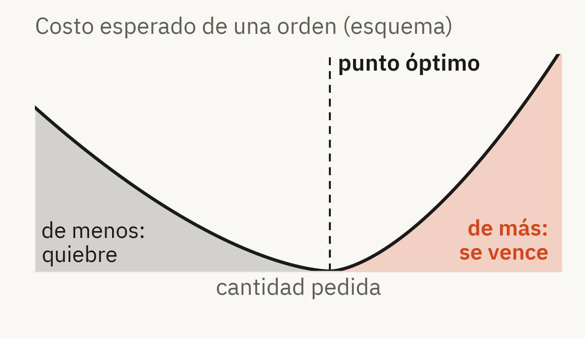

# El problema: pedir algo que vence

Todos los días, cada tienda decide cuánto reponer de cada fresco. Los dos errores cuestan:

- **Pedir de menos**: quiebre de stock y venta perdida
- **Pedir de más**: el sobrante se vence y es pérdida total

Hoy se decide con una regla manual, el **promedio de las últimas semanas**, que no estima incertidumbre.

> Y los datos engañan: cuando hubo quiebre, la venta registrada es menor que la demanda.

<!--
⏱ 1:00 · acumulado 1:15

Visual: costo esperado de una orden en función de la cantidad pedida (esquema, sin unidades).

- Contexto: retail de perecederos. La reposición se decide todos los días, por tienda y por producto.
- Hay dos errores y los dos cuestan. Pedir de menos genera quiebre y venta perdida. Pedir de más genera sobrante que, en frescos, se vence: no es capital inmovilizado, es pérdida total.
- El gráfico muestra la idea: hay una cantidad que minimiza el costo esperado, y no está en el promedio. Depende de cuánto cuesta cada error.
- Hoy la regla es manual: el promedio de las últimas semanas. No estima incertidumbre, así que los dos errores conviven y el sobrestock funciona como un seguro caro y ciego.
- Y hay un problema anterior, que la mayoría de los pipelines ignora: cuando un producto se agota, la venta registrada es menor que lo que la gente quiso comprar. Si aprendo de esa venta, aprendo a pedir de menos.
- Transición: "Esto define lo que tiene que hacer la solución."
-->

---

# La solución planteada

Blindside recomienda una **cantidad a pedir** por tienda × producto, en tres pasos:

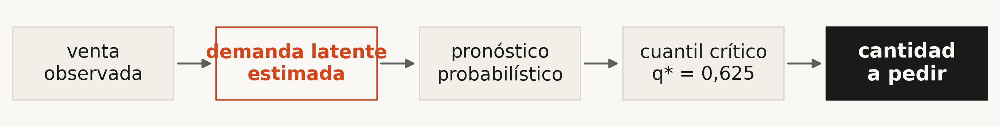

1. **Corrige lo que la venta oculta**: estima la demanda de las horas sin stock
2. **Pronostica con incertidumbre**: no un número, un rango calibrado
3. **Traduce el pronóstico a una orden** según el costo de cada error

Cómo sé si funciona: **mejorar al menos 20 %** el error de la referencia y un **intervalo que cubra el 90 %**.

<!--
⏱ 1:00 · acumulado 2:15

Visual: flujo de cinco pasos, de venta observada a cantidad a pedir.

- La solución no termina en una predicción. Termina en cuánto pedir.
- Paso 1: el dataset anota el stock hora por hora, así que puedo estimar cuánta demanda quedó oculta en las horas de quiebre. Le llamo demanda latente estimada.
- Paso 2: pronostico la distribución de la demanda, no solo un valor. Eso me da un rango con cobertura calibrada con CQR.
- Paso 3: con el costo de quedarse corto y el de quedarse largo, elijo el punto de esa distribución que minimiza el costo esperado. Es el newsvendor clásico, y acá el cuantil es 0,625.
- Se entrega como producto: una API y una interfaz que responden "qué pedir hoy".
- Dos objetivos medibles, definidos antes de ver resultados: reducir el MASE al menos 20 % contra el naive estacional, y un intervalo con 90 % de cobertura nominal. Al final muestro que el primero se cumple y el segundo queda dos puntos abajo.
-->

---

<!-- _class: chica -->

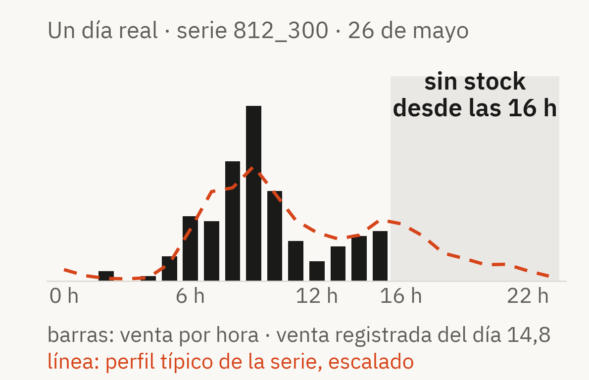

# El dataset: FreshRetailNet-50K

Retail de frescos de Dingdong · 50.000 series · 898 tiendas · 18 ciudades · 865 productos · CC BY 4.0

| Grupo | Campos | Uso en Blindside |
|---|---|---|
| Jerarquía | ciudad, tienda, grupo, 3 niveles de categoría, producto | Categóricas del modelo global |
| Venta | venta diaria y venta por hora (24 valores) | Target y perfil intradiario |
| **Stock** | **estado por hora (24 valores), horas de quiebre** | **Detectar y corregir el quiebre** |
| Plan comercial | descuento, feriado, actividad | Covariables conocidas a futuro |
| Clima | lluvia, temperatura, humedad, viento | Solo con rezago: a 7 días no se conoce |

Uso **3.066 series** de 38 tiendas completas: 309 productos, 97 días, 297.402 filas. **43,9 %** de los días tiene al menos una hora de quiebre.

<!--
⏱ 1:00 · acumulado 3:15

Visual: tabla de los 19 campos agrupados y un día real con quiebre (serie 812_300, 26 de mayo).

- FreshRetailNet-50K es un dataset público de Dingdong, un retail chino de frescos. 50.000 series tienda × producto, 898 tiendas, 18 ciudades, 865 productos perecederos, licencia CC BY 4.0.
- Tiene 19 campos. Los agrupo por para qué sirven:
  - Jerarquía: ciudad, tienda, grupo de gestión, tres niveles de categoría y producto. Entran como categóricas.
  - Venta: la diaria y la de cada hora.
  - Stock: el estado de cada hora. Este es el motivo por el que elegí el dataset: sin saber cuándo faltó stock no se puede medir la demanda oculta.
  - Plan comercial: descuento, feriado y actividad. Se conocen de antemano, así que pueden usarse para el horizonte sin fuga.
  - Clima: solo entra rezagado, porque a 7 días no se conoce.
- El gráfico es un día real: el producto se agota a las 16 h. La venta registrada es 14,8, pero el perfil típico de esa misma serie dice que a la tarde se seguía vendiendo. Esa diferencia es lo que Blindside corrige.
- Uso 3.066 series: tiendas completas elegidas con semilla fija, para no romper la jerarquía. 97 días (90 de train y 7 de eval oficiales).
- 43,9 % de los días tiene al menos una hora de quiebre: no es un caso raro, es casi la mitad.
- Límites declarados: magnitudes escaladas por un coeficiente no divulgado (por eso no hay moneda) y es retail chino (nivel y feriados no se transfieren sin reentrenar).
-->

---

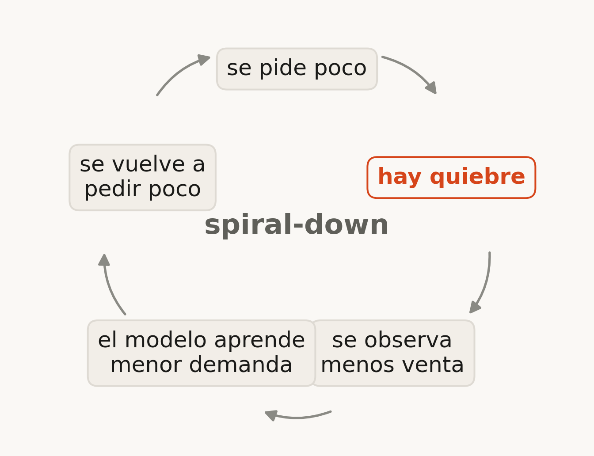

# Cuando hay quiebre, la venta miente

Si el modelo aprende de la venta registrada, aprende una demanda **artificialmente baja**, y el error se realimenta.

Blindside entrena sobre la **demanda latente estimada**. Mismo modelo, dos entrenamientos:

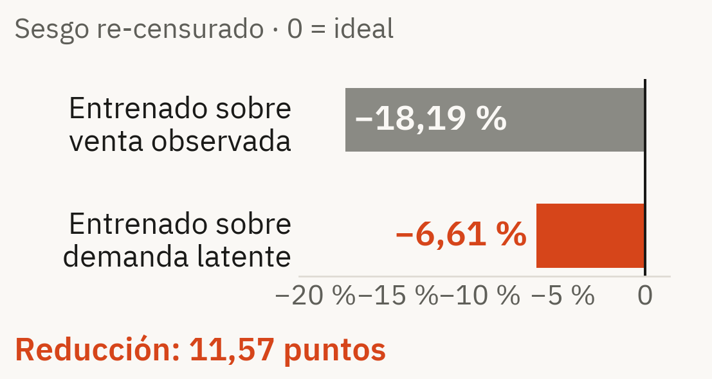

<!--
⏱ 1:00 · acumulado 4:15

Visual: ciclo spiral-down a la izquierda y barras de la ablación a la derecha.

- Esto es lo que pasa si ignoro el quiebre: se pide poco, hay quiebre, se registra menos venta, el modelo aprende menos demanda y vuelve a pedir poco. Es el efecto spiral-down.
- La corrección usa las horas con stock para estimar el perfil del día y reconstruir la demanda de las horas sin stock. Es conservadora: nunca da menos que la venta observada, limita la inflación a ×3 y no corrige si queda menos del 15 % del día observable.
- Para medir si sirve hice una ablación: el mismo modelo, entrenado dos veces, cambiando solo el target.
- Sesgo re-censurado: −18,19 % entrenando con la venta, −6,61 % con la demanda recuperada. 11,57 puntos menos de sesgo.
- Lo llamo "demanda latente estimada", no demanda real: sigue quedando sesgo residual, y es una elección conservadora.
- Si preguntan por CADRE: no comparo niveles (este panel tiene 2,2 veces más sesgo sin corregir), comparo reducciones: 11,57 acá contra 6,8. Backups E y H.
-->

---

<!-- _class: chica ancho modelos -->

# Qué modelos probé y por qué

| Modelo | Por qué está en la comparación | MASE |
|---|---|---:|
| Naive estacional | Referencia: repite la semana anterior. Es la vara del objetivo | 1,1002 |
| Media móvil 21 días | Es la **regla actual** de reposición: promedio de las últimas semanas | 0,9048 |
| Croston SBA | Diseñado para demanda **intermitente**, con muchos ceros | 0,8952 |
| Ridge | Mismas features que el boosting, pero lineal: mide cuánto aporta la no linealidad | 0,9018 |
| SARIMA · Prophet \* | Clásicos **por serie**: ¿el global solo le gana a baselines simples? | 0,9136 · 0,9698 |
| LightGBM global | Un modelo para todas las series: cruza calendario, precio, quiebres y jerarquía | 0,8222 |
| **LightGBM cuantílico + CQR** | **El servido**: se entrena en el cuantil de la orden y calibra el intervalo | **0,8217** |

*MASE medio sobre 3.066 series y 8 orígenes. \* SARIMA y Prophet sobre 400 series, donde LightGBM da 0,8386.*

<!--
⏱ 1:15 · acumulado 5:30

Visual: tabla modelo, justificación y score.

- Cada modelo está para responder una pregunta, no para perder.
- Naive estacional: es la referencia del objetivo SMART y el denominador del MASE. 1,1002.
- Media móvil de 21 días: es literalmente la regla que se usa hoy. Si no le gano a esto, el proyecto no tiene sentido. 0,9048, ya 17,8 % mejor que el naive estacional: es un rival duro.
- Croston SBA: el estándar para demanda intermitente, que es la mayoría de este panel. 0,8952, el mejor baseline.
- Ridge: usa exactamente las mismas features que el boosting. La diferencia entre Ridge (0,9018) y LightGBM (0,8222) es lo que aporta modelar interacciones no lineales.
- SARIMA y Prophet: responden la objeción "un global solo le gana a baselines simples". Por costo se miden sobre 400 series: 0,9136 y 0,9698, contra 0,8386 del LightGBM en esas mismas series.
- LightGBM global: 0,8222.
- El servido es LightGBM cuantílico con CQR: mismo punto central (0,8217), pero entrenado en el cuantil que minimiza el costo y con un intervalo calibrado. El envoltorio conformal no toca la predicción central; por eso los dos MASE casi coinciden.
- Qué es MASE: el error del modelo dividido por el error del naive estacional en train. Menor que 1 es mejor que la referencia; permite comparar productos de escalas distintas. No uso MAPE porque explota con demanda cercana a cero.
- Lasso, ElasticNet y XGBoost también están implementados como contraste, pero no forman parte del reporte oficial de 3.066 series; por eso no están en la tabla.
-->

---

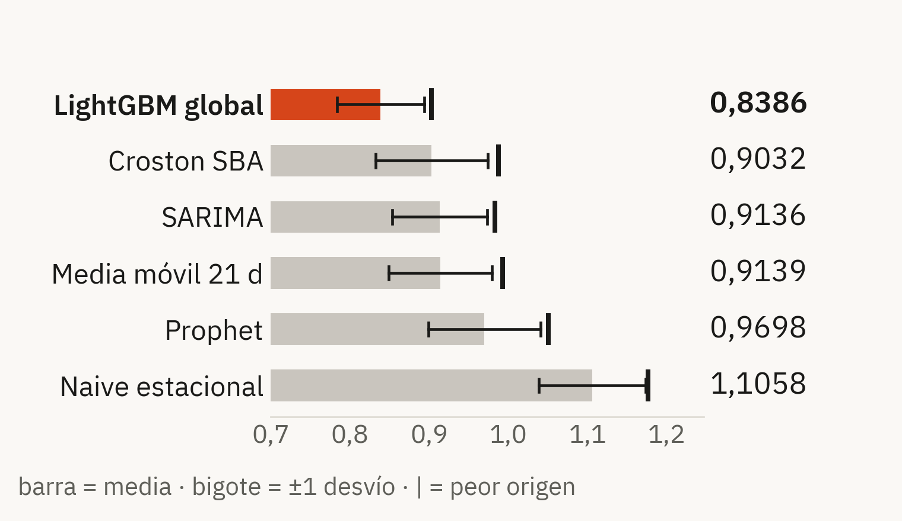

# Un solo modelo global

**LightGBM cuantílico global**: un modelo aprende de las 3.066 series.

Con 97 días por serie, 3.066 modelos aislados desperdiciarían lo que las series comparten.

Sigue distinguiendo productos: recibe ciudad, tienda, grupo, 3 niveles de categoría y producto como categóricas.

> SARIMA empata con la media móvil de 21 días.

*Contraste clásico · 400 series · 8 orígenes*

<!--
⏱ 0:45 · acumulado 6:15

Visual: MASE del contraste clásico con desvío y peor origen.

- Por qué un modelo global y no uno por serie: con 97 días por serie, entrenar 3.066 modelos aislados desperdicia lo que comparten. Un producto aprende del patrón semanal de toda su categoría.
- No pierde identidad: recibe ciudad, tienda, grupo de gestión, tres niveles de categoría y producto como categóricas.
- El dato que más dice: SARIMA queda empatado con la media móvil de 21 días (0,9136 contra 0,9139). En series cortas e intermitentes su complejidad no compra precisión.
- No es que SARIMA o Prophet sean malos: 97 días no permiten estimar un ciclo anual, no están en su escenario ideal.
- Backup C si preguntan por la orden fija de SARIMA.
-->

---

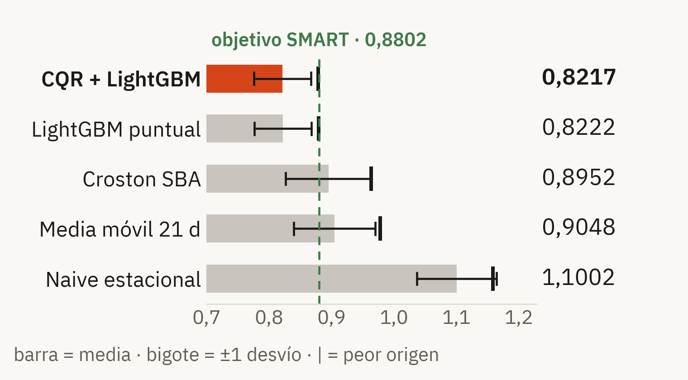

# ¿Funciona?

**25,3 % menos error** que la referencia.

MASE **0,8217**
*± 0,0454 · peor origen 0,8790*

Objetivo: al menos 20 %. **Cumplido**, también en el peor de los 8 orígenes.

*3.066 series · 8 orígenes · 7 días · 1.545.264 predicciones*

<!--
⏱ 0:45 · acumulado 7:00

Visual: MASE por modelo con desvío y peor origen; línea verde del objetivo SMART.

- Cómo se evalúa: backtesting de origen móvil. Me paro en un día, entreno solo con el pasado, pronostico 7 días y repito en 8 orígenes. 1.545.264 predicciones.
- Resultado: MASE 0,8217 con desvío 0,0454. 25,3 % mejor que el naive estacional. El objetivo era 20 %: cumplido.
- Y no es un promedio que esconde un origen malo: el peor origen (0,8790) también queda debajo de la línea del objetivo.
- Por qué el naive estacional da 1,1002 y no 1: el denominador del MASE se calcula en train y el numerador fuera de muestra.
-->

---

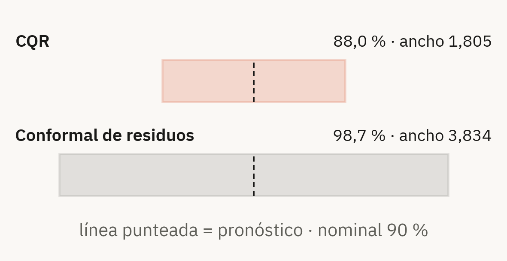

# Cuán seguro está el pronóstico

Para decidir no alcanza un número: hace falta un **rango confiable**.

CQR cubre **88,0 %** con una banda **53 % más angosta** que la alternativa.

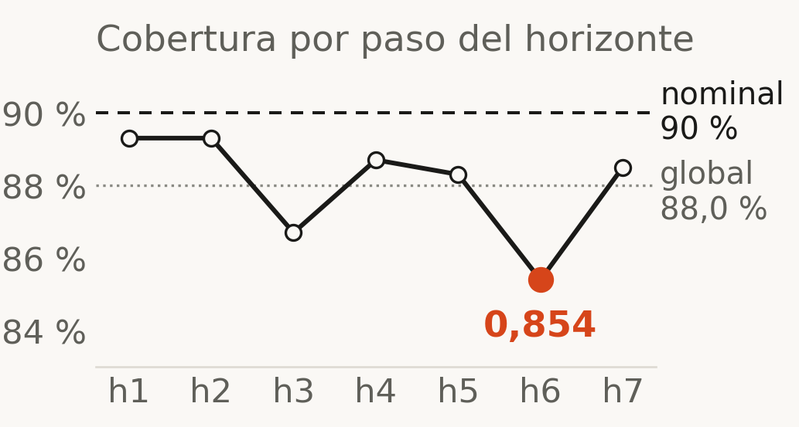

> Sub-cubre dos puntos: limitación real y declarada.

<!--
⏱ 1:00 · acumulado 8:00

Visual: bandas comparadas (CQR contra conformal de residuos) y cobertura por paso del horizonte.

- En producto: el rango le dice al encargado cuánto puede variar la demanda. Si dice 90 %, tiene que acertar 90 % de las veces.
- CQR mide 88,0 % con ancho medio 1,805. El conformal de residuos cubre 98,7 %, pero con el doble de ancho (3,834): un rango tan ancho no ayuda a decidir. Una banda infinita cubre 100 % y no informa nada.
- No digo que se cumple el 90 %: sub-cubre dos puntos, y el objetivo no se movió después de ver el dato.
- La garantía es marginal, no condicional: por horizonte baja hasta 0,854 en el paso 6.
- Lo importante para la decisión: la cantidad a pedir no sale del intervalo, sale del modelo entrenado en el cuantil de la orden. La sub-cobertura afecta la banda, no directamente la orden.
- Backup D para la diferencia entre los scores.
-->

---

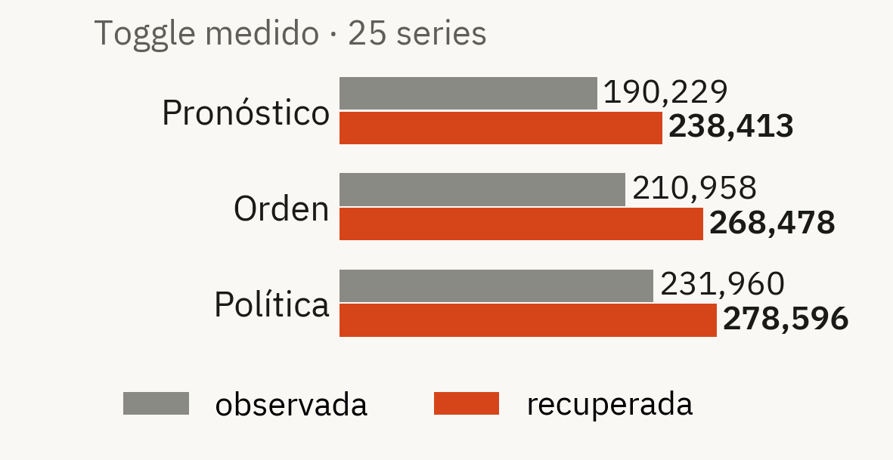

# De pronóstico a cantidad a pedir

$$q^* = \frac{C_u}{C_u + C_o} = 0{,}625$$

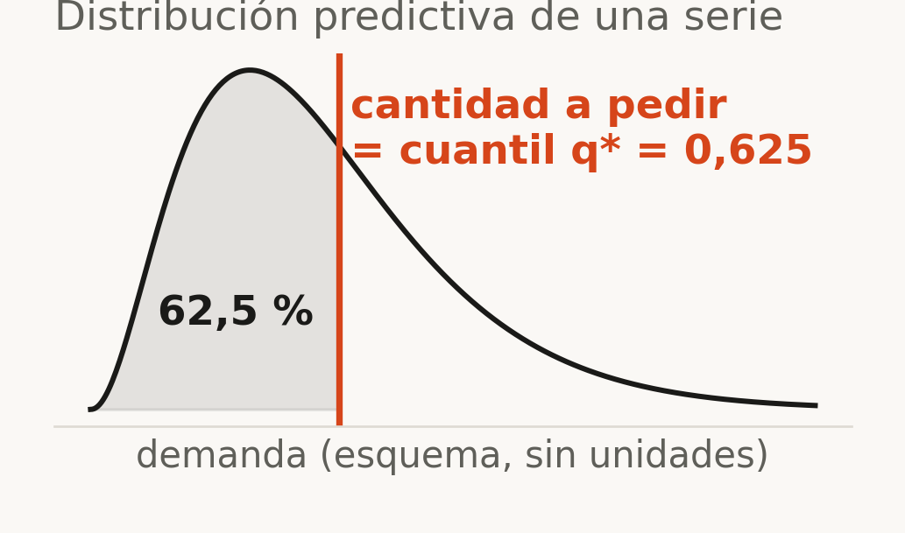

> El modelo se entrena en $q^*$: la predicción en ese cuantil **es** la orden.

<!--
⏱ 1:00 · acumulado 9:00

Visual: fórmula, esquema del cuantil sobre la distribución y el toggle medido.

- Esto cierra el problema del principio. Cu es el costo de quedarse corto, Co el de quedarse largo. En perecederos quedarse largo es pérdida total.
- La cantidad que minimiza el costo esperado es el cuantil q* = Cu / (Cu + Co) de la demanda. Acá 0,625: conviene pedir un poco por encima de la mediana.
- En vez de pronosticar un promedio y sumarle un stock de seguridad a ojo, entreno el modelo directamente en ese cuantil. Su salida es la orden.
- Medido sobre 25 series, sumas adimensionales: con venta observada, orden 210,958; con demanda recuperada, 268,478. Corregir la censura sube el pronóstico 25,3 % y la orden 27,3 %.
- Sin moneda: el dataset está escalado por un coeficiente no divulgado. El ROI es relativo.
- Encuadre honesto: es un resultado de la literatura aplicado de punta a punta, no una contribución teórica propia. Backup H.
-->

---

<!-- _class: demo -->

# El producto: qué pedir hoy

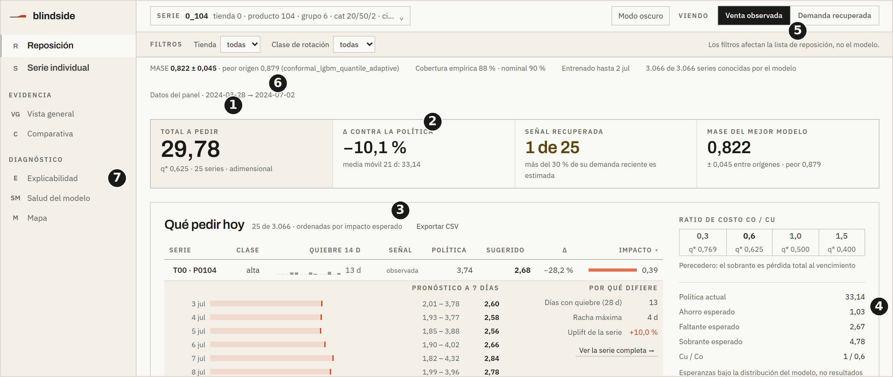

1. **Cantidad sugerida**: total a pedir y columna Sugerido
2. **Política de comparación**: media móvil 21 días, misma base
3. **Estado de señal**: observada, parcial, en quiebre
4. **Faltante y sobrante esperados**
5. **Toggle**: venta observada ↔ demanda recuperada
6. **Cobertura 88 % vs 90 %**; MASE en Salud del modelo
7. **Explicación TreeSHAP** en Explicabilidad

<!--
⏱ 2:00 · acumulado 11:00

Visual: captura real de Reposición (docs/assets/reposicion.png) con siete marcadores.

Demo en React, abre en Reposición. No saltar a Streamlit durante la demo.
1. Reposición abierta: la pantalla responde una sola pregunta, qué pedir hoy. 3.066 series, cantidad sugerida y la política actual al lado.
2. Activar el toggle de censura. Decir: "cambia la cantidad a pedir, no solo el dibujo". Hay dos artefactos con la misma arquitectura, uno por base. 210,958 → 268,478.
3. Abrir una serie con señal parcial.
4. Mostrar el intervalo y la política de media móvil al lado de la del modelo.
5. Abrir la explicación: aportes por feature con TreeSHAP, para que el encargado entienda por qué el número es ese.
6. Si queda tiempo: Salud del modelo, con MASE y cobertura servidos por la API.

Si el vivo falla: proyectar el video y narrar encima.
Streamlit es la red de seguridad independiente: abre en "Qué mirar primero", el triage del catálogo.
-->

---

# Lo que no funcionó también se publica

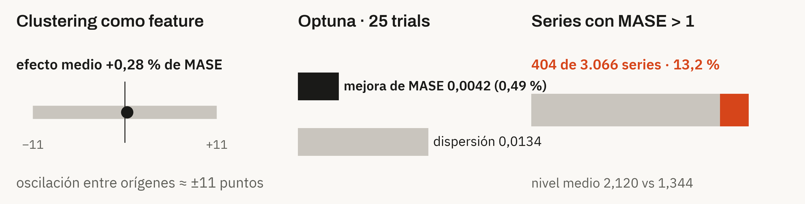

- **Clustering**: no entra al artefacto. Y FreshRetailNet no permite medir arranque en frío: todas las series tienen 97 días
- **Optuna**: la mejora es menor que la dispersión entre orígenes, y el mejor trial dispersa más. No se adopta
- **404 series pierden contra el naive estacional**, y no son las chicas. La interfaz las marca "Modelo no confiable"

> Publicar lo que no funcionó es control de sobreajuste, no debilidad.

<!--
⏱ 1:00 · acumulado 12:00

Visual: tres paneles, efecto contra ruido.

- Clustering sobre perfiles de demanda como feature: efecto medio +0,28 % de MASE, con oscilación de aproximadamente ±11 puntos entre orígenes. Es ruido; no entra al artefacto servido.
- Arranque en frío: no se puede medir con este dataset. Todas las series tienen exactamente 97 días, ninguna tiene menos de 21, ninguna empieza a vender después del día 16.
- Optuna, 25 trials sobre 400 series y 4 orígenes: parámetros actuales 0,8672 (desvío 0,0134), mejor trial 0,8630 (desvío 0,0153). Mejora de 0,49 %, menor que la dispersión entre orígenes, y con más dispersión. No se adopta; el criterio estaba escrito antes de ver el número.
- Rendimiento por serie: 404 series, 13,2 %, tienen MASE > 1. No son chicas: nivel medio 2,120 contra 1,344 del panel. El MASE global de 0,8217 es cierto y esconde eso; por eso la interfaz lo muestra en vez de esconderlo.
-->

---

<!-- _class: chica cierre -->

# Qué falta para producción

| Implementado | Limitaciones | Próxima versión |
|---|---|---|
| Recuperación de censura, antifugas, backtesting móvil | 97 días de historia · horizonte 7 | Ingesta diaria idempotente |
| LightGBM cuantílico + CQR + newsvendor | Cobertura 88 % vs 90 % nominal; garantía marginal | Candidato, promoción atómica y rollback |
| SARIMA, Prophet, clustering, Isolation Forest, Optuna | Sin lead time, multi-echelon, mínimos ni cajas | Frescura visible en `/health` |
| TreeSHAP · API FastAPI | Sin actualización continua ni drift | Drift y política de reentrenamiento |
| React 7 pantallas · Streamlit 8 pantallas | Sin autenticación: no exponer públicamente | Datos propios de 12–24 meses |
| 290 tests Python · 41 frontend · 12 Playwright | ROI relativo, no monetario | Restricciones operativas de inventario |

> Blindside corrige primero lo que la venta oculta, pronostica después y termina en una decisión económica auditable.

<!--
⏱ 0:45 · acumulado 12:45

Visual: tabla de tres columnas.

- Implementado: recuperación de censura, features ancladas en el origen, backtesting móvil con antifugas, LightGBM puntual y cuantílico, CQR, newsvendor, SARIMA y Prophet como contraste, clustering e Isolation Forest, Optuna, TreeSHAP local y global, API FastAPI, React de 7 pantallas y Streamlit de 8. 290 tests Python, 41 de frontend y 12 de Playwright.
- Limitaciones, dichas antes de que las pregunten: 97 días, horizonte 7, cobertura 88 %, garantía marginal, sin lead time ni multi-echelon, sin mínimos de compra ni múltiplos de caja, sin actualización continua, sin drift, sin autenticación, ROI relativo porque la escala del dataset no está divulgada.
- Próxima versión, en este orden: ingesta idempotente, candidato con promoción atómica y rollback, frescura en /health, drift y reentrenamiento, datos propios de 12 a 24 meses, restricciones operativas.
- Cierre: volver al problema del principio. "Empecé con dos errores que cuestan y una venta que engaña. Blindside corrige primero lo que la venta oculta, pronostica después y termina en una decisión económica auditable." Pasar a preguntas.
-->

---

<!-- _class: separador -->
<!-- _paginate: false -->

# Respaldo

Slides A a I para preguntas. No entran en los 15 minutos.

---

<!-- _class: chica ancho -->

# A · Ocho controles antifugas

| Assert | Qué fuga detecta | Caso negativo inyectado |
|---|---|---|
| Sin features posteriores a *t* | Información del día objetivo | Feature que depende del día objetivo |
| Futuro sin target | Verdad en el índice de futuro | Columna de target en el futuro |
| Lags agrupados y ordenados | Una serie lee el final de otra | `shift` sin agrupar |
| Sin agregados globales | Promedio del panel completo | Media global pegada como feature |
| Sin target encoding del futuro | Copia del target | Target copiado (correlación ≥ 0,999) |
| Escalador ajustado en el fold | Media del panel en el train | Escalador ajustado con todo el panel |
| Shuffle y alineación | Modelo que no depende del target | Target permutado o corrido un día |
| Folds disjuntos | Solapamiento train/test | Test que empieza antes del origen |

<!--
Fuente: README, tabla del checklist, y tests/test_leakage.py.
- Cada assert tiene su caso negativo: un test antifugas que pasa siempre, incluso con fuga presente, es peor que no tenerlo.
- Shuffle: al permutar el target el modelo no le gana al mejor constante. Alineación: correr el target un día empeora la métrica en las dos direcciones.
- Comando: make test-leakage.
-->

---

# B · Por qué 7 días y no 28

- FreshRetailNet tiene **97 días** por serie
- Con horizonte de 28, caben **como máximo 4 orígenes** de backtest
- La metodología exige **8**
- El split oficial de evaluación tiene exactamente **7 días**

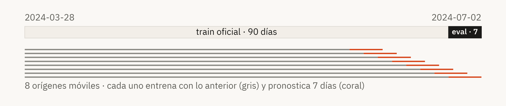

<!--
- La degradación por horizonte se reporta: MASE por paso de 0,7536 en h1 a 0,8337 en h7 (CQR).
- Para horizontes largos hace falta más historia, no otro modelo.
-->

---

# C · SARIMA fijo vs AutoARIMA

| | MASE | Tiempo por serie |
|---|---:|---:|
| **Orden fija** | **0,9566** | **85 ms** |
| AutoARIMA | 0,9657 | 2,3 s |

> La orden fija no perjudicó al contraste: da mejor MASE y es 27 veces más rápida.

<!--
- La pregunta de fondo es si SARIMA quedó mal por una mala elección de orden. No: AutoARIMA da peor MASE.
- 2,3 s / 85 ms ≈ 27.
-->

---

# D · CQR vs conformal de residuos

$$s_{\text{residuo}} = |y - \hat{y}|$$

$$s_{\text{CQR}} = \max\left(\hat{q}_{lo} - y,\; y - \hat{q}_{hi}\right)$$

- El score CQR **puede ser negativo**: si los cuantiles ya cubren de más, la calibración **aprieta** el intervalo
- El de residuos absolutos **solo puede ensanchar**
- Resultado: 88,0 % con ancho 1,805 contra 98,7 % con ancho 3,834

<!--
- Garantía marginal, no condicional: supone intercambiabilidad, que una partición temporal cumple de forma aproximada.
- Cobertura por horizonte: 0,893 · 0,893 · 0,867 · 0,887 · 0,883 · 0,854 · 0,885. Corregir el paso 6 exige conformal condicional o por grupo.
-->

---

# E · Recuperación de censura

1. **Perfil horario**: con las horas con stock se estima el perfil de demanda intradiario del día
2. **Peso disponible**: la fracción de la masa diaria que cae en horas con stock
3. **Factor de inflación**: la masa perdida en horas de quiebre se reconstruye a partir de ese peso

**Topes conservadores**
- Nunca por debajo de la venta observada: la venta ocurrió
- Inflación máxima **×3**
- Sin corrección si queda menos del **15 %** de la masa diaria observable

<!--
- Sin tope, un día con 15 de 16 franjas en quiebre y una venta chica implicaría una demanda dieciséis veces mayor apoyada en un único dato.
- Se prefiere un sesgo residual conocido a una varianza inventada (D11). Por eso la corrección queda por debajo de la de CADRE.
- Hay un segundo recuperador, Tobit-EWMA, como contraste de método.
-->

---

# F · Actualización continua

**Hoy: batch.** Panel y artefactos se cargan al arrancar la API. Sin ingesta, recarga, drift ni rollback.

**Roadmap**

ingesta idempotente → candidato → backtest → promoción atómica → observabilidad → drift → rollback

> Un endpoint que reciba un CSV no es actualización continua.

<!--
- Sería abrir una ruta de escritura sin idempotencia, atomicidad, auth, drift ni rollback.
- Primer paso barato: guardar como candidato, smoke forecast, promover con os.replace y conservar la versión anterior. Frescura visible en /health (staleness no es drift).
-->

---

# G · Por qué no ampliar FreshRetailNet

- La fuente tiene **90 + 7 días**; las columnas horarias son 24 observaciones **dentro** de cada día
- **Más series sí; más días no**
- Más series no agrega anualidad ni arranque en frío
- Para más tiempo hace falta **otra fuente con 12–24 meses**

<!--
- La fuente tiene 50.000 series, 898 tiendas y 18 ciudades; el proyecto usa 3.066, 38 tiendas y 309 productos.
- Ampliar series invalida todos los números publicados: hay que regenerar artefactos, backtests, ablación y tuning.
- Una segunda fuente necesita las mismas claves, etiqueta de quiebre o stock, precio/descuento, feriados y altas reales de productos.
-->

---

# H · Literatura y novedad

- **FreshRetailNet-50K** · Dingdong-Inc · arXiv 2505.16319
- **CADRE** · recuperación de demanda sobre el mismo dataset · MDPI Sustainability 18(15):7642
- **Cao 2024** · conformalización del cuantil crítico · arXiv 2412.13159
- Equivalencia entre pronóstico cuantílico calibrado y newsvendor · MDPI JRFM 19(3):173

> La contribución no es inventar conformal + newsvendor. Es implementar y evaluar el pipeline completo, con recuperación de censura y decisión operativa.

<!--
- Lo raro no es la idea, es tenerla corriendo de punta a punta: la mayoría de las implementaciones reales usan stock de seguridad heurístico en vez de un cuantil con cobertura verificada.
- CADRE: −8,1 % → −1,3 %. Acá −18,19 % → −6,61 %. Los niveles no son comparables por el submuestreo; la reducción sí (11,57 contra 6,8 puntos).
-->

---

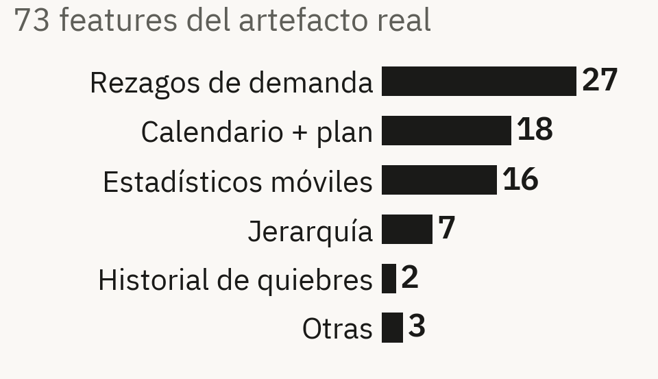

# I · Pipeline y antifugas

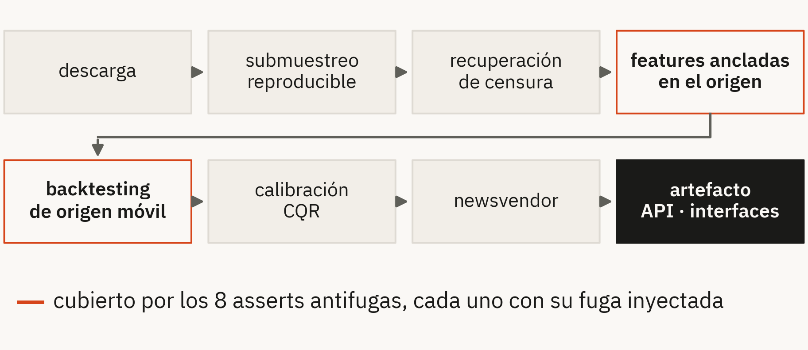

Los controles encontraron defectos reales:
- `is_censored` del día objetivo entraba como feature
- `days_since_start` tenía otra ancla en inferencia
- Las covariables futuras llegaban como NaN a la API

> La ausencia de leakage no se declara: se prueba con tests que fallan.

<!--
- El pipeline va de la descarga al artefacto servido por la API y las interfaces. La recuperación de censura va antes de las features: un promedio móvil sobre la venta observada ya propagó el sesgo.
- 73 features, contadas del artefacto real: 27 rezagos, 18 de calendario y plan comercial, 16 estadísticos móviles, 7 de jerarquía, 2 de historia de quiebres y 3 otras. Todas ancladas en el origen.
- 8 asserts antifugas, cada uno con su caso negativo (backup A). Encontraron defectos reales: is_censored del día objetivo como feature, days_since_start con otra ancla en inferencia y covariables futuras en NaN en la API.
-->
